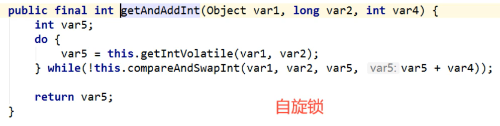
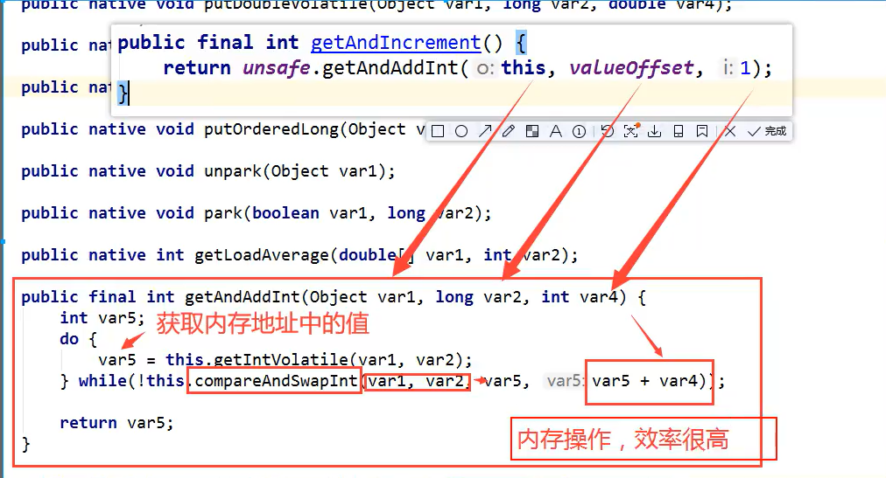

## CAS
### 什么是CAS
全称是compare and set(比较并交换)，是CPU的并发原语。（比较当前工作内存中的值与主内存的值，如果这个值
是期望的，那么则执行操作。如果不是，就会一直循环，因为是自旋锁）
如CasDemo1中的例子，调用了APIatomicInteger.compareAndSet(2021, 2022)，其中API源码如下：
```java

    /**
     * Atomically sets the value to the given updated value
     * if the current value {@code ==} the expected value.
     *
     * @param expect the expected value
     * @param update the new value
     * @return {@code true} if successful. False return indicates that
     * the actual value was not equal to the expected value.
     */
    public final boolean compareAndSet(int expect, int update) {
        return unsafe.compareAndSwapInt(this, valueOffset, expect, update);
    }
```
若期待的值是2021，则替换成2022。
但上面的API只是java层面的CAS，再深入细节往下看。
继续调用了unsafe.compareAndSwapInt(this, valueOffset, expect, update);

如上图所示：
java本不可以直接操作内存，需要通过调用C++来操作内存，比如调用本地native方法。
但是实际也留了一个后门UnSafe类，这个类是可以直接操作内存的。



如上图AtomicInteger.getAndIncrement()方法的详细解读。比较内存地址与期待内存地址是否一致，一致的
话则将期待值加1。它是一个自旋锁！

### 缺点
1、循环会耗时；
2、一次性只能保证一个共享变量的原子性；
3、ABA问题
