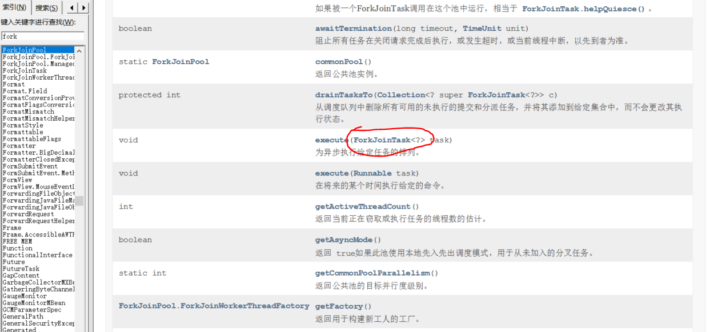
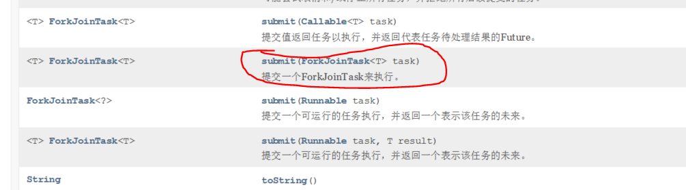
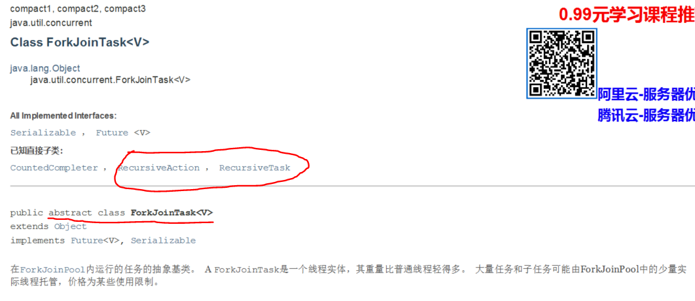
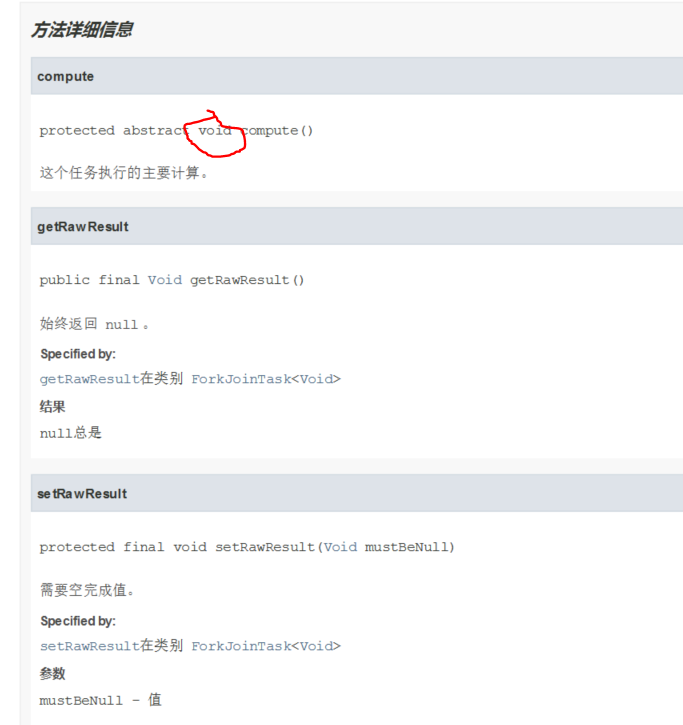
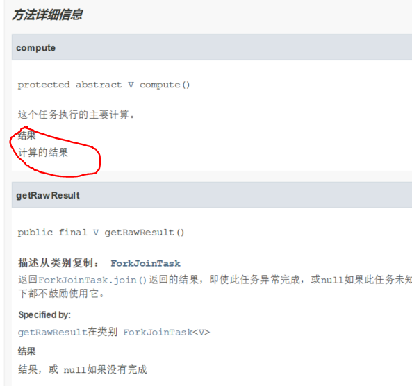

# ForkJoin理解
forkjoin可以并行执行任务，提高效率。即可将一个任务拆分成多个子任务来并行执行，
然后将各个任务的结果进行汇总，得到最终的结果。概念上理解如下图：

## ForkJoin工作特点
工作窃取！

如上图所示，当线程B执行完成之后，会从线程B的任务里拿任务来继续执行。因为任务维护的都是
双端队列，可以从两端取任务来执行！从而提高整体的效率。

## 使用ForkJoin的学习思路
当我们确定要使用ForkJoinPool后，可以去查看ForkJoinPool的官方手册，可以查看excute方法和submit方法，如下：

传参为ForkJoinTask，再来看看ForkJoinTask的官方手册

可以看出来ForkJoinTask是一个抽象类，再看看其子类RecursiveAction和RecursiveTask，
首先是RecursiveAction，方法如下：

**没有返回值**，因此在我们的求和场景不合适
然后再看看RecursiveTask

**会返回计算结果**

因此我们的ForkJoinPool会用到RecursiveTask！

