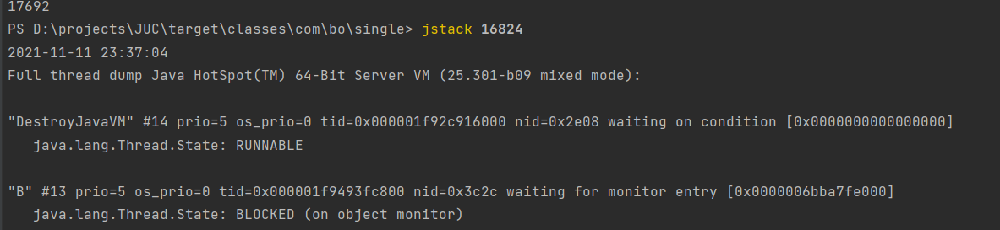

# 公平锁和非公平锁
公平锁：非常公平，不允许插队，先来后到的顺序执行
非公平锁：可以插队，默认都是非公平锁。

# 可重入锁
## 什么是可重入锁
* 每个Java对象都可以用做一个实现同步的锁，这些锁被称为内置锁或监视器锁。
线程在进入同步代码块之前会自动获取锁，并且在退出同步代码块时会自动释放锁。
获得内置锁的唯一途径就是进入由这个锁保护的同步代码块或方法。
当某个线程请求一个由其他线程持有的锁时，发出请求的线程就会阻塞。
* 然而，由于内置锁是可重入的，因此如果摸个线程试图获得一个已经由它自己持有的锁，
那么这个请求就会成功。“重入”意味着获取锁的操作的粒度是“线程”，而不是调用。
重入的一种实现方法是，**为每个锁关联一个获取计数值和一个所有者线程。当计数值为0时，
这个锁就被认为是没有被任何线程所持有，当线程请求一个未被持有的锁时，JVM将记下锁的持有者，
并且将获取计数值置为1，如果同一个线程再次获取这个锁，计数值将递增，而当线程退出同步代码块时，
计数器会相应地递减。**
当计数值为0时，这个锁将被释放。

# 自旋锁
## 什么时自旋锁
是指当一个线程在获取锁的时候，如果锁已经被其它线程获取，那么该线程将循环等待，
然后不断的判断锁是否能够被成功获取，直到获取到锁才会退出循环。

## 自旋锁优点
* 自旋锁不会使线程状态发生切换，一直处于用户态，即线程一直都是active的；不会使线程进入阻塞状态，
减少了不必要的上下文切换，执行速度快。
* 非自旋锁在获取不到锁的时候会进入阻塞状态，从而进入内核态，当获取到锁的时候需要从内核态恢复，需
要线程上下文切换。 （线程被阻塞后便进入内核（Linux）调度状态，这个会导致系统在用户态与内核态之
间来回切换，严重影响锁的性能）

## 自旋锁缺点
* 如果某个线程持有锁的时间过长，就会导致其它等待获取锁的线程进入循环等待，消耗CPU。
使用不当会造成CPU使用率极高。

# 怎么定位死锁
## 首先执行jps -l查看当前的java进程

## 然后执行jstack pid查看死锁原因

可仔细查看两个线程等待的锁分别是对方持有的锁！